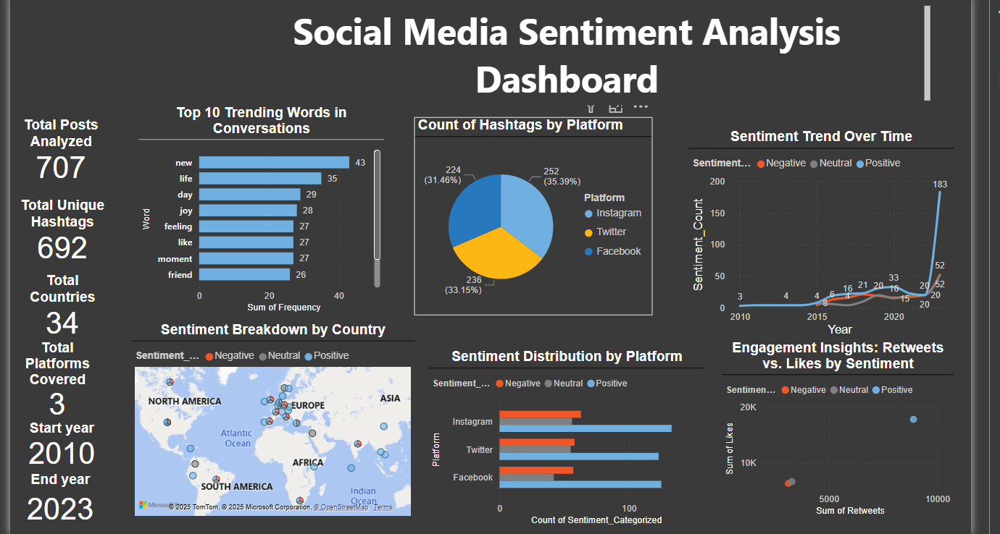
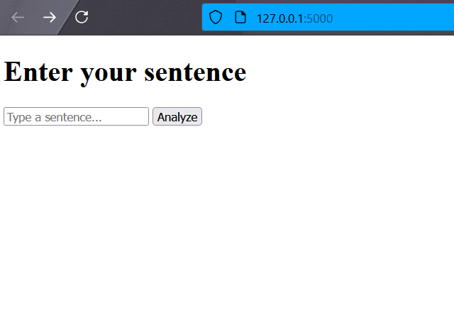
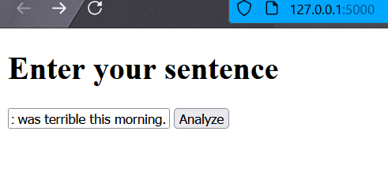
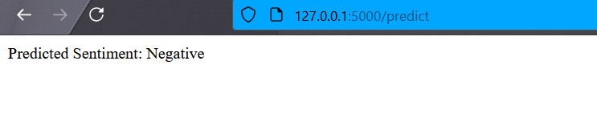

#  Social Media Trend Analysis

##  Task 1

### 🔹 Project Overview
This project analyzes trending topics on **Twitter, Instagram, and LinkedIn** to understand **user interests and market shifts** using **Natural Language Processing (NLP) and Sentiment Analysis**.  

I implemented ** sentiment classification using Random Forest, and deployed the model using Flask**. The final output includes a **dashboard for visualizing trends and a Flask web app for real-time predictions**.

---

##  Tools & Technologies
- **Python **: Scikit-learn, Flask  
- **Machine Learning **: TF-IDF Vectorizer, Random Forest Classifier  
- **Deployment  **: Flask API  
- **Visualization **: Power BI 

---

##  Features
**Loads data and performs data cleaning and handling missing values** 
 **Applies NLP preprocessing** (Tokenization, Stopword removal, TF-IDF)  
 **Performs Sentiment Analysis** (Positive, Neutral, Negative)  
 **Trains a Random Forest Model** for sentiment classification  
 **Deploys model using Flask** for real-time predictions  
 **Builds a Power BI dashboard** to visualize trends  

---

##  Screenshots

###  Dashboard Overview


### Model Deployment (Flask App)


### Sentiment Prediction Example

#### User Input


#### Model Output



---

##  How to Run Locally

### 1️⃣ Clone the Repository
```bash
git clone https://github.com/LornaGathoni1/FUTURE_DS_01.git
cd FUTURE_DS_01
